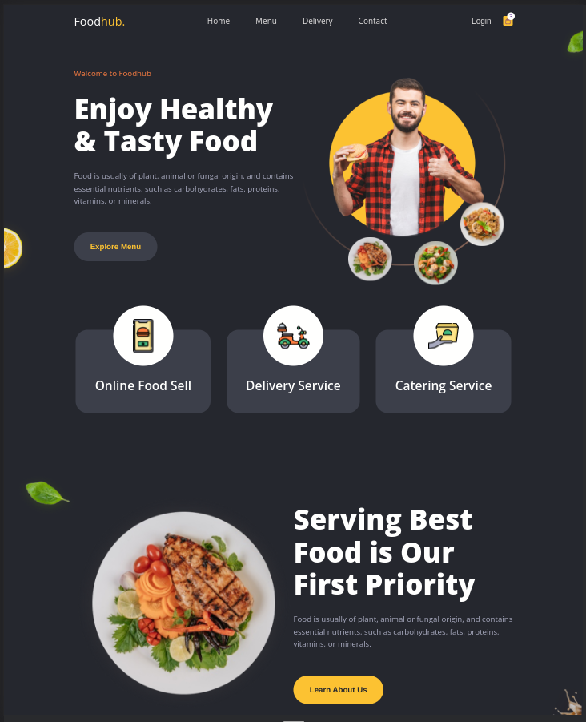

# FOODHUB


## Установка и запуск

Для локального запуска

-  репозиторий

```
git clone https://github.com/VladislavBobyrev/foodhub
```

<div align="left">



#

## Проект сожержит

<details>
  <summary>SCSS</summary>
 
  [Что это?](https://sass-scss.ru/)
  Sass является наиболее развитым и стабильным расширением CSS профессионального уровня.
</details>

<details>
  <summary>Семантическую вёрстку</summary>
 
  [Что это?](https://htmlacademy.ru/blog/articles/semantics)

     Подход к разметке, который опирается не на содержание сайта, а на смысловое предназначение каждого блока и логическую структуру документа. Даже в этой статье есть заголовки разных уровней — это помогает читателю выстроить в голове структуру документа. Так и на странице сайта — только читатели будут немного другими.

</details>
<details>
  <summary>BEM</summary>
 
  [Что это?](https://ru.bem.info/methodology/quick-start/) 
 
    БЭМ (Блок, Элемент, Модификатор) — компонентный подход к веб-разработке. В его основе лежит принцип разделения интерфейса на независимые блоки. Он позволяет легко и быстро разрабатывать интерфейсы любой сложности и повторно использовать существующий код, избегая «Copy-Paste».
</details>


#

## Связвться со мной

<div align='center'> 
 
 ```
vladislavbobyrev@yandex.ru
```
 
 [](https://t.me/VladislavBobyrev)

 </div>
 
<div align="center">
  <h2>**ВНИМАНИЕ!**  Вся конфигурация является открытой. </h2>
 
</div>